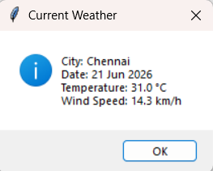
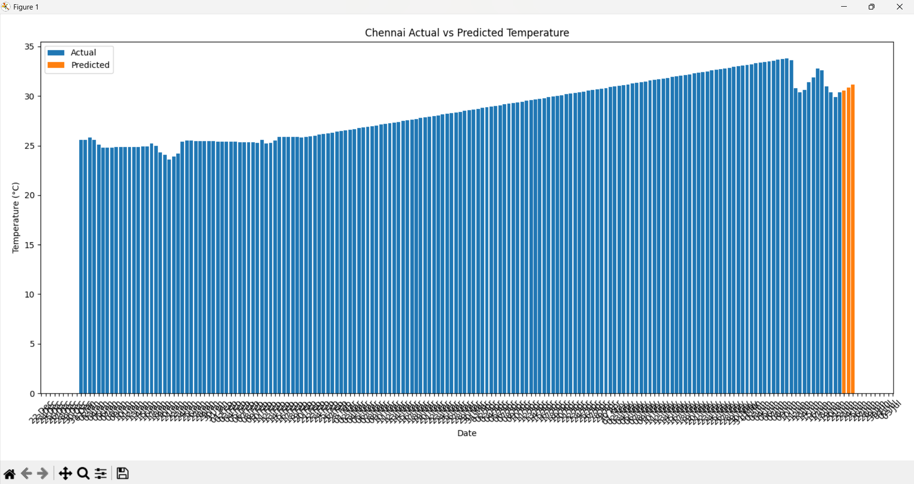

# Weather Prediction System

## Team Members

* Deepak R (192511008)
* Vijay A (192511030)

## My Contributions (Deepak R)

I was responsible for the development and implementation of **Module 2 – Weather Trend Prediction and Analysis**.

### Key Contributions

* Designed the weather trend prediction workflow.
* Developed temperature forecasting logic using historical weather data.
* Implemented weather data analysis and visualization techniques.
* Integrated weather prediction with real-time weather retrieval.
* Generated graphical insights using line and bar chart visualizations.
* Assisted in testing, validation, and performance evaluation of the prediction system.
* Participated in project documentation and result analysis.

## Technologies Used

* Python
* Tkinter
* Pandas
* Matplotlib
* MySQL
* Requests
* Open-Meteo API

## Features

* Current Weather Information
* City-Based Weather Search
* Historical Weather Data Storage
* Weather Trend Analysis
* Temperature Prediction
* Line Graph Visualization
* Bar Graph Visualization
* MySQL Database Integration
* Interactive GUI Dashboard

## Project Overview

Weather Prediction System is a Python-based desktop application that retrieves real-time weather information and predicts future temperature trends using historical weather data. The system stores weather records in a MySQL database, performs trend analysis, and visualizes actual and predicted temperatures through interactive charts. It provides users with an easy-to-use interface for weather monitoring and forecasting.

## Screenshots

### Weather Prediction Interface


### Current Weather Output



### Actual vs Predicted Temperature



## How to Run

1. Install Python 3.8 or above.
2. Install required libraries:

```bash
pip install pandas matplotlib requests mysql-connector-python
```

3. Create the MySQL database:

```sql
CREATE DATABASE weather_db;
```

4. Import the provided database file:

```bash
mysql -u root -p weather_db < weather_db.sql
```

5. Update MySQL credentials inside:

```text
weather_prediction_system.py
```

6. Run the application:

```bash
python weather_prediction_system.py
```

## Database

The project uses MySQL for storing:

* Historical weather records
* Predicted weather data
* City-based weather information

## Future Enhancements

* Machine Learning-Based Forecasting
* Rainfall Prediction
* Humidity Prediction
* Multi-City Comparison
* Weather Alerts and Notifications
* Advanced Dashboard Analytics
